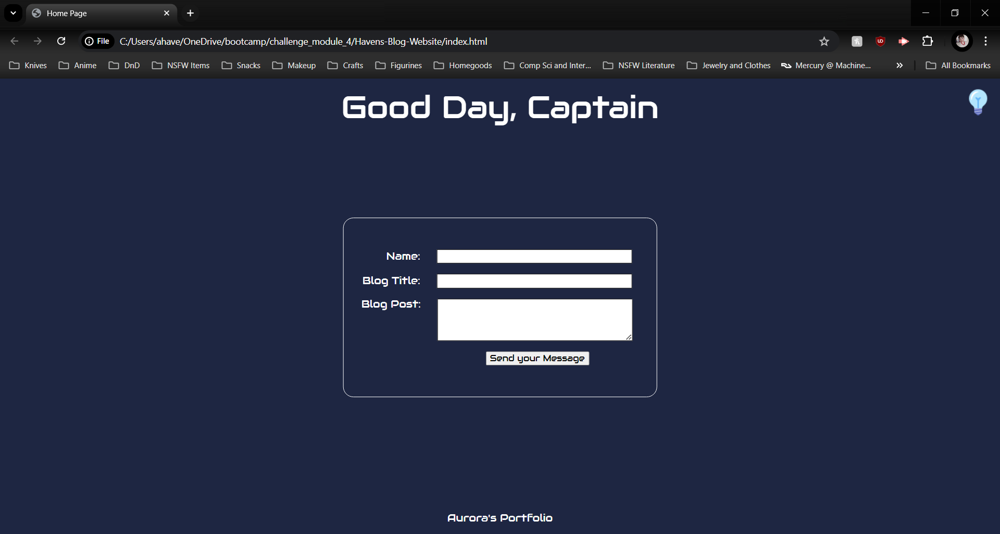
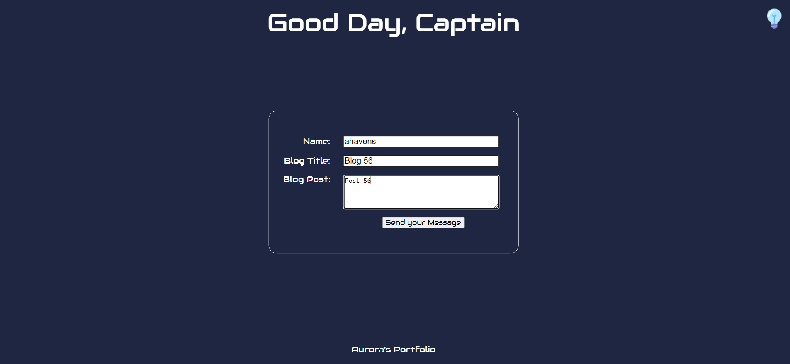
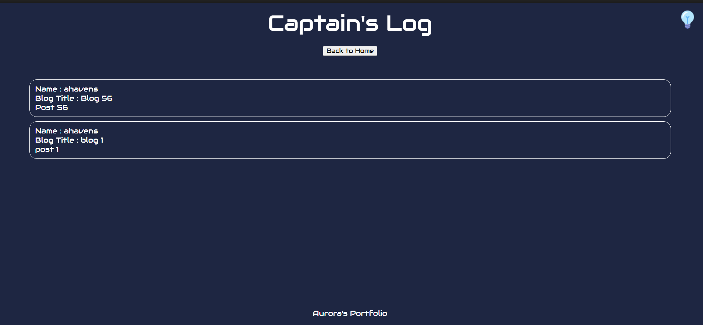
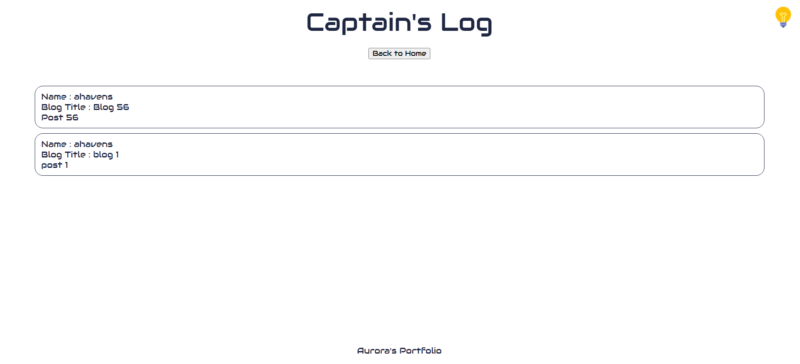
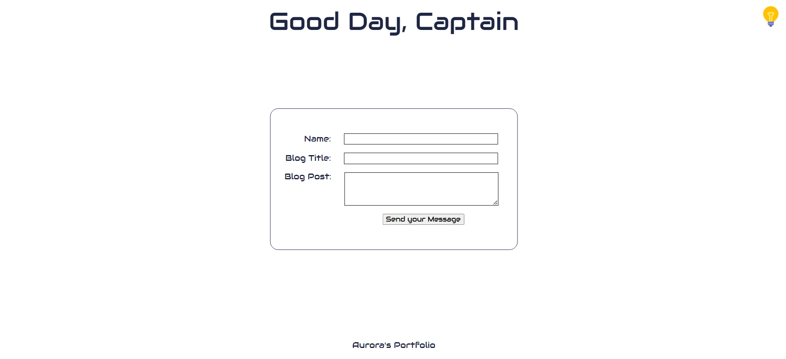

# Havens-Blog-Website

## Table of Contents
- [Description](#description)
    - [Built With](#built-with)
- [Getting Started](#getting-started)
- [Usage](#usage)
- [License](#license)
- [Contact](#contact)

## Description
This project allows a user to submit a blog post with their username, blog title, and post. When the user submits a post, they will be redirected to the blog page where they can view previous posts stored in local memory. There is also a bulb allowing users to toggle the theme from dark to light.

https://ahavens1995.github.io/Havens-Blog-Website/

### Built with
Project built with:
* JavaScript
* HTML
* CSS

## Getting Started 
To use the payroll tracker, perform the following:
1. Open the github page: https://ahavens1995.github.io/Havens-Blog-Website/
    
2. Enter the following:
    * Name
    * Blog Title
    * Blog Post \
        
3. After you add all the information, select "Send Message"
4. You will be redirected to the blog page where you can view all posts stored in local memory
    
5. To change the theme on either page, select the light bulb button in the upper right corner \
    
6. Here is light mode:
    
    

## Usage
Please use this as an initial look into how Javascript functions and methods interact with HTML and CSS.

## License
No license has been used

## Contact
Aurora Havens
https://ahavens1995.github.io/Havens-Blog-Website/